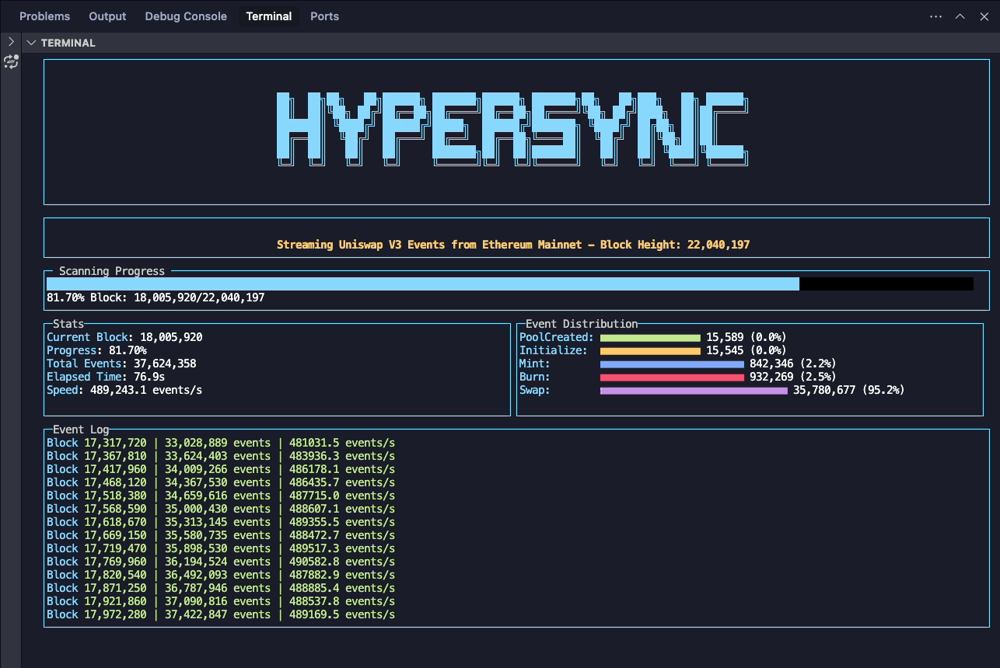

# LogTUI

A terminal-based UI for monitoring blockchain events using Hypersync.



## Quickstart

Try it with a single command:

```bash
# Monitor transfer amounts on Ethereum (using pnpx)
pnpx logtui -e "Transfer(address,address,uint256)" -p 2 -n eth

# Monitor swap amounts on Arbitrum (using npx)
npx logtui -e "Swap(address,uint256,uint256,uint256,address,bytes32)" -p 1 -n arbitrum

# Monitor events from a specific contract
pnpx logtui -e "Transfer(address,address,uint256)" -c 0x1234... -n eth

# See all available options
pnpx logtui --help
```

## Features

- Real-time monitoring of blockchain events with a beautiful terminal UI
- Supports **all Hypersync-enabled networks** (Ethereum, Arbitrum, Optimism, etc.)
- Custom event signature support
- Event parameter tracking by index
- Contract-specific event monitoring
- Event distribution visualization
- Progress tracking and statistics
- Automatic network discovery from Hypersync API with persistent caching

## Installation

### Global Installation

```bash
npm install -g logtui
# or
yarn global add logtui
# or
pnpm add -g logtui
```

## Usage

### CLI

```bash
# Monitor transfer amounts on Ethereum (third parameter)
logtui -e "Transfer(address,address,uint256)" -p 2 -n eth

# Monitor events from a specific contract
logtui -e "Transfer(address,address,uint256)" -c 0x1234... -n eth

# List all available networks
logtui --list-networks

# Force refresh the network list from Hypersync API (updates cache)
logtui --refresh-networks
```

### Network Discovery

LogTUI automatically discovers and caches all networks supported by Hypersync:

1. On first run, it loads the default networks
2. It then attempts to fetch all available networks from the Hypersync API
3. Networks are cached locally for future use, even when offline
4. Use `--refresh-networks` to force update the cached network list

This ensures you always have access to all supported networks, even when working offline.

### CLI Options

```
Usage: logtui [options]

Options:
  -V, --version           output the version number
  -e, --event <event>     Event signature to monitor
  -p, --param <index>     Index of the event parameter to track (0-based)
  -c, --contract <addr>   Contract address to monitor
  -n, --network <network> Network to connect to (default: "eth")
  -t, --title <title>     Custom title for the scanner (default: "Blockchain Event Scanner")
  -N, --list-networks     List all available networks and exit
  --refresh-networks      Force refresh network list from API
  -v, --verbose           Show additional info in the console
  -h, --help              display help for command
```

## Supported Networks

LogTUI automatically discovers all networks supported by Hypersync. The following are some commonly used networks:

### Mainnets

- `eth`: Ethereum Mainnet
- `arbitrum`: Arbitrum One
- `optimism`: Optimism
- `base`: Base
- `polygon`: Polygon PoS
- And many more...

### Testnets

- `arbitrum-sepolia`: Arbitrum Sepolia
- `optimism-sepolia`: Optimism Sepolia
- And more...

Run `logtui --list-networks` to see the complete, up-to-date list of all supported networks.

## Development

```bash
# Clone the repository
git clone https://github.com/yourusername/logtui.git
cd logtui

# Install dependencies
npm install

# Run the development version
node bin/logtui.js
```

## Acknowledgements

- Built with [Hypersync](https://docs.envio.dev/docs/HyperIndex/overview) by Envio
- Terminal UI powered by [blessed](https://github.com/chjj/blessed)
